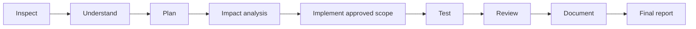

# Agentic development guide

Status: **Phase 0 documentation only**. An AI agent must not mistake proposed filenames or routes for implemented features. Application implementation requires explicit approval of the next phase.

Product is **Food Intelligence Platform**, target repository `food-intelligence-platform`. Read [PRODUCT_DOMAIN.md](PRODUCT_DOMAIN.md) before any implementation. The existing `index.js` is **Legacy Prototype / Reference**, not a food-business logic foundation. Do not spend effort preserving its internals or speculative client compatibility. Target roots are `apps/api/`, `apps/web/`, `apps/docs/`, `packages/shared/`, `docker/`; current paths remain unchanged until a reviewed move.

## What to give an agent

| Give it | Why |
| --- | --- |
| Repository and exact branch/working tree | It needs the actual files and must preserve other work |
| README, [product domain](PRODUCT_DOMAIN.md), and [audit](BACKEND_AUDIT.md) | README documents identity/rename status; domain defines the new product; audit records legacy behavior |
| [Architecture diagrams](docs/content/architecture/diagrams.md) and [stack decisions](STACK_DECISION.md) | Explain current, target, and future boundaries |
| [Codebase map](CODEBASE_MAP.md) | Shows where features are now and proposed ownership |
| [Database design](DATABASE_DESIGN.md) and actual schema when later implemented | Prevents guesses about tables, relationships, and money/stock rules |
| [API flows](API_USER_FLOW.md) and generated OpenAPI when available | Distinguishes planned routes from real contracts |
| [Change-impact map](CHANGE_IMPACT_MAP.md) | Identifies callers and affected behavior |
| Coding rules below and any later repository instructions | Defines ownership and approval scope |
| Sanitized environment template | Explains variable names; never provide real secrets |
| [Testing plan](docs/content/testing/index.md) | Defines evidence required, not imaginary passing tests |
| [Deployment plan](docs/content/deployment/index.md), [migration plan](MIGRATION_PLAN.md), [upgrade guide](UPGRADE_GUIDE.md) | Makes recovery and production boundaries explicit |

## Workflow

1. Inspect source, dependencies, configuration names, callers, tests, and Git status. Confirm files exist before citing them. Inspect sanitized data samples only with authorization.
2. Explain the observed behavior and proposed change separately. Missing tests or data means uncertainty, not permission to invent facts.
3. Plan the smallest phase and list API, schema, event, job, security, and client impact. Respect the user's phase boundary.
4. Implement only when authorized. Keep business rules in NestJS services, persistence in repositories/Drizzle, and presentation in the chosen frontend. Astro is documentation only.
5. Test the risky behavior: unauthorized requests, cross-business access, concurrent stock use, duplicate jobs/webhooks, decimal totals, and failed dependencies. Report skipped checks and why.
6. Review diffs for secrets, data loss, incompatible contracts, and accidental edits. Update canonical docs and maps with code changes.
7. Report changed files, behavior, tests actually run, failures, remaining risks, and proposed next phase. Never claim completion based on a plan alone.

## Coding rules for later implementation

- TypeScript/NestJS + PostgreSQL/Drizzle/pg; one ORM per target domain. Do not replace the whole server blindly.
- One primary DTO validation strategy; no trusting raw request bodies, role fields, prices, or client-selected ownership.
- Tenant scope and permissions are enforced at every entry point, including sockets and job-produced mutations.
- Inventory service owns stock updates in transactions; immutable ledger and historical snapshots preserve auditability.
- Use exact money/quantity representations, bounded queries, stable event versions, idempotency, and structured redacted logs.
- Treat users/menu/carts/reviews/JWT as conceptual mappings only. Preserve source/data, not obsolete architecture. Build compatibility/import only for an approved concrete requirement; never carry forward insecure `/jwt` behavior.
- No secrets, real exports, raw cards, tokens, or customer data in docs, Git, screenshots, or test fixtures.
- No production migration, destructive reset, force push, or deployment based solely on documentation approval.
- Do not install frontend/ML tooling or build unrelated features to make the architecture look complete.

## Do not assume

Do not assume MongoDB shapes are correct, a deployed client needs compatibility, legacy emails/roles are trustworthy, or history is complete. Use explicit domain assumptions for units/tax/returns/permissions and disclose what still needs owner confirmation. Do not silently change package metadata, folder/GitHub identity, authentication, schema, environment, Docker, or data during this documentation pass. Do not create deferred tables/modules merely because a diagram mentions them.
