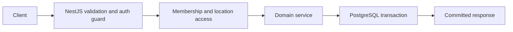

# Food Intelligence Platform — API and user flows

**Implemented Backend 2.0:** REST endpoints use `/api/v1`. Swagger UI is `/api/docs`. The global guard requires a signed 10-minute access token backed by an active verified user/session except on registration, verification, login, refresh, recovery and health. The service then checks active membership, allowed role and assigned location. DTOs reject unknown fields. IDs are never authorization by themselves.

## Access and setup

Register → receive a Mailpit/deployment-provider verification message → verify single-use token → login with password → receive access token and HttpOnly rotating refresh cookie. Refresh and logout require the configured Origin. Password reset revokes sessions. Create business → owner membership is inserted atomically → add locations, categories, suppliers and products → add members and assign STAFF/VIEWER location grants. OWNER/ADMIN have all locations; STAFF/VIEWER have only assigned locations. No legacy `/jwt` route exists.

## Stock and sales

Receive stock creates a batch, PURCHASE movement and position increase in one transaction. A sale snapshots product name/price, approved discount and business tax; FEFO allocates known unexpired/nonperishable stock across batches, writes SALE movements and decreases positions. Insufficient stock aborts the whole order. A return references the original allocation, reverses proportional net/tax, and restocks only inspected saleable quantity via RETURN movement. Disposed customer-return goods are waste without another stock decrement. Owner/admin transfers create paired movement entries and a destination provenance batch. Batch stock waste creates WASTE movement and decreases position. Unique operation keys protect retries.

## Intelligence

Request-time expiry classification uses each business's configured critical/warning hours and batch expiry as exclusive next-day start. Analytics are scoped to the caller's authorized locations. The rules-based **Baseline recommendation** reads near-expiry batches and recent sales velocity, returning reasons without mutation. OWNER/ADMIN explicitly approve a discount with cost-floor validation. No queue, Socket.IO, payment or ML workflow is active.

Endpoint families: `auth`, `businesses`, `businesses/{id}/locations`, `members`, `categories`, `products`, `suppliers`, `inventory`, `orders`, `waste`, `inventory/expiry`, `discount-recommendations`, `discounts`, and `analytics/{kind}`. Use the generated OpenAPI page for exact request DTOs and status codes. [USER_MANUAL.md](USER_MANUAL.md) gives operational instructions; [CODEBASE_MAP.md](CODEBASE_MAP.md) links ownership to source.
