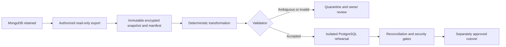

# Food Intelligence Platform — transition and conditional migration plan

Status: **TARGET BACKEND 2.0 — non-executed plan**. Build the independent domain in [PRODUCT_DOMAIN.md](PRODUCT_DOMAIN.md); do not refactor the prototype into a business foundation. No exports, imports, MongoDB writes, credential changes, directory moves, package changes, or production operations occur now. Legacy data migration is conditional on a demonstrated real requirement. No compatibility layer is part of MVP by default.

## Legacy → Backend 2.0 Mapping

| Legacy concept | Target ownership | Conceptual reference only |
| --- | --- | --- |
| `users` | `users` + `business_memberships` | Independently verified identity and scoped membership; no inherited admin status |
| `menu` | `products` + `categories` | Candidate concepts only; source fields/units are not target rules |
| `carts` | `carts` + `cart_items` | Deferred optional feature; no automatic import |
| `reviews` | `reviews` | Deferred optional feature; no automatic import |
| JWT | New authentication/session system | Local verified-password assumption, rotating/revocable sessions; reject old tokens |

Only if an identified client requires compatibility should its safe contract be characterized and a bounded adapter considered. `/jwt`, public admin mutations, arbitrary role fields, and unowned cart access are never compatibility promises. A fresh deployment can start with new verified accounts and approved business stocktake data, leaving MongoDB intact and unused.

## Identity and local workspace transition — pending

The [README assessment](README.md) inventories the actual local directory, GitHub origin, package/lockfile name, runtime strings, and future Docker names. Documentation identity is now Food Intelligence Platform / `food-intelligence-platform`; non-document surfaces remain unchanged.

After separate approval: preserve uncommitted files and inventory active processes/editor paths; confirm `E:\Food related software\food-intelligence-platform` is absent; close users of the child checkout; rename only the child folder within `E:\Food related software`; reopen and verify the checkout/remote. Do not move the parent Codex project or modify `BistroDB`. Then change package and lockfile root names together during monorepo setup, without opportunistic dependency upgrades. Configure new app identities and future Compose project `food-intelligence-platform`; never rename/delete data volumes as branding.

GitHub requires the repository owner/admin: existing repository → Settings → General → Repository name → `food-intelligence-platform` → Rename. Review integrations/Pages, then update local origin to the verified new URL. No hosted or local rename has been performed. The monorepo transition also moves authored `docs/` to `apps/docs/` only after rewriting/testing relative links (topic-to-root depth increases by one) and build allowlists. Do not create duplicate editable documentation trees.

## Import decision gate

Before the pipeline below, record the actual data owner/client, collection scope, business need, target business mapping, retention policy, and acceptance criteria. Without that evidence, do not build import scripts, ID aliases, or compatibility DTOs. Security requirements apply to the new system regardless of import; legacy secret exposure must be addressed before any shared credentials/data or traffic transition. This conditional plan does not imply legacy adoption.

## Conditional data pipeline — only after approval

1. **Discovery, only for approved data:** obtain authorized sanitized samples and metadata, counts, indexes, field/type distribution, references, any actual client contract, and business ownership evidence. No production data belongs in Git, portal content, logs, or agent prompts.
2. **Export:** later use a read-only account and a consistency strategy appropriate to the source deployment. Capture source snapshot boundary, collection counts, checksums, and tool/version manifest. Encrypt access-controlled exports. Inventory databases before selecting any source.
3. **Transform:** deterministic versioned transformation with an external mapping artifact keyed by source database/collection/ObjectId and target table/UUID. Preserve raw exported documents outside runtime tables. Produce explicit accepted/quarantined/merged dispositions; dry runs never overwrite the source.
4. **Validate:** validate target types, mandatory fields, semantic ranges, identity/tenant ownership, unique keys, and references. Reject rather than silently coerce conflicting currency, unknown units, negative quantity, or invalid IDs.
5. **Rehearse:** import accepted data into an isolated PostgreSQL database inside bounded transactions. Repeat safely using stable IDs/import keys. Run schema checks, fixture/API tests, tenant isolation, and reconciliation. No live import at this stage.
6. **Cutover, later approval:** take verified backups, rehearse restore, freeze legacy writes or approve a separately designed change-capture process, capture a final consistent export, reconcile, revoke old tokens, deploy the secured target, and explicitly switch traffic. Avoid casual dual writes.

## Data decisions and unresolved cases

| Concern | Required handling |
| --- | --- |
| Unknown fields | Profile first; classify as mapped, intentionally dropped with approval, retained in protected export, or quarantined. Do not guess menu/cart schemas |
| Duplicates | Normalize email under a reviewed policy; report collisions. Do not auto-merge people, reviews, or carts merely because names/emails look similar |
| Invalid roles | Map through an approved role allowlist; unknown/conflicting roles quarantine membership, not elevate access. Owner verifies every privileged assignment |
| ObjectIds | For selected imports only, stable source-to-UUID mapping for every reference. Do not expose legacy IDs or build compatibility DTOs unless a real client requires them |
| Cart ownership | Email input is untrusted. Require verified account linkage and business mapping; quarantine ambiguous rows. Reprice at checkout, not from imported client prices |
| Missing history | No fabricated sales, expiry, movements, purchase cost, or timestamps. Approved stocktake becomes an explicitly labeled opening ADJUSTMENT with provenance; forecasting starts at verified coverage date |
| Authentication | Existing JWTs do not prove identity. Force reauthentication through selected verified mechanism; revoke/rotate legacy signing material. No invented passwords |
| Businesses | Source has no demonstrated tenant model. Owner must assign source records to businesses; never guess by email domain |
| Reviews | Decide nullable historical authors, rating scale, moderation, and delete/privacy policy after source profiling |

## Reconciliation and acceptance

For every source collection, account for all records as accepted, quarantined, or explicitly excluded; record merged-source lineage separately. Compare per-business counts, mapping completeness, orphan references, duplicate keys, and representative field-level samples. Verify transformed cart line quantities against accepted source rows; do not compare carts to sales totals. Validate any approved opening balances against stocktake records, not guessed MongoDB history. Require zero unexplained discrepancies, no unapproved privileged membership, passing tenant/ownership tests, and signed disposition of quarantine cases before release.

Security SEC-01 through SEC-07 cannot carry into the new release. For an actual import/cutover add source/target backup restore evidence, migration hashes, contract checks for any approved compatibility scope, import rerun evidence, and data coverage limits. A failed gate leaves traffic and source untouched. Fresh MVP work does not need a speculative legacy API compatibility report.

## Rollback

Before cutover: discard/recreate only the isolated rehearsal target when separately authorized; source remains intact. After cutover but before target writes: restore traffic only to a security-remediated legacy release, never the known-vulnerable server. If none exists, use maintenance mode while rolling forward.

After target writes: stop writes and reconcile target-only orders, stock, and payments; do not blindly switch back to MongoDB or reverse financial effects. Prefer a compatible application rollback or forward repair. Backups alone cannot reverse external payments. Record recovery point/time objectives and decision owner before production approval. Never delete MongoDB data as a migration step; retention/decommissioning requires a separate approved plan.
