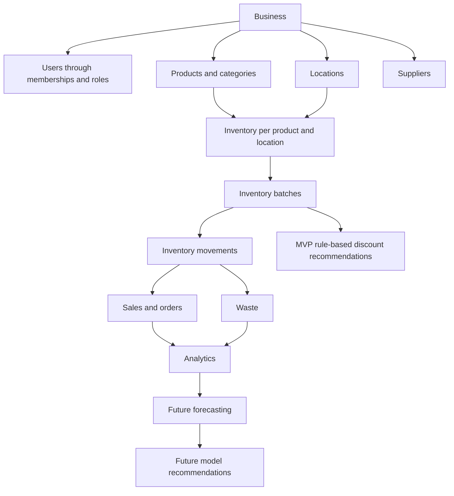

# Food Intelligence Platform — product domain

Status: **TARGET BACKEND 2.0 design; no implementation authorized**. Repository/product slug: `food-intelligence-platform`. This document supersedes earlier assumptions that the legacy prototype is a business-logic foundation or that its API must be preserved. Decisions below are explicit MVP design assumptions, not facts inferred from MongoDB or approvals to implement.

## Product definition

Food Intelligence Platform is a multi-tenant food-business intelligence platform for restaurants and food businesses to manage products, suppliers, locations, inventory, batches, stock movements, sales, expiry, waste, discounts, and analytics. It builds trustworthy historical data for demand forecasting and future AI/ML-powered recommendations. Its first recommendations are transparent rules; advanced models are future work.

The existing Express/MongoDB `index.js` is **Legacy Prototype / Reference**. It contains small CRUD/API handlers, not meaningful food-business domain logic. Do not preserve its internal architecture, infer the new schema from its document shapes, or port its insecure `/jwt` behavior. Source/data are left intact; conceptual reuse does not create a migration or compatibility obligation.

## Actors and business model

- **User:** a global verified person/account that can belong to multiple businesses.
- **Business owner:** creates a business and controls membership, ownership, settings, and all its locations.
- **Administrator:** manages business operations and staff/viewer access without granting ownership or other admin authority.
- **Staff member:** receives stock, records sales and waste at explicitly assigned locations.
- **Viewer:** reads inventory/expiry and analytics at explicitly assigned locations; cannot mutate business data.
- **System job:** later performs scoped expiry/reconciliation work using a narrowly defined service identity, not an unrestricted user role.

The platform's subscription/pricing model is not defined. MVP sales are the food business's operational sales records, not charges for using this platform. Customers do not need platform accounts for a staff-recorded sale.

This is a conceptual workflow, not a strict containment chain: products belong to a business and can be stocked at many locations; users are global and linked by memberships; sales/waste reference batches and movements.

## Multi-tenancy and ownership

Use a shared PostgreSQL schema with explicit `business_id` on every business-owned resource. One user may belong to many businesses; one business may have many locations. All requests select one business and validate an active membership before repository access. A token's user identity or a caller-supplied business ID alone grants no access.

**Business creation:** a verified user submits name, timezone, and one currency. In one transaction create the business and its first owner membership. Create locations explicitly afterward. Use an idempotency key; clients cannot choose another user's owner identity. Last-owner removal/demotion is rejected. Ownership transfer requires an existing verified member and current-owner reauthentication, transactionally preserving at least one owner.

**Membership:** owners add verified existing users and assign roles; administrators may add/manage staff/viewers only. No silent account creation or public email-directory lookup. MVP onboarding can use a verified user's shared account ID; invitation email flows are future UX, not a reason to invent privileged accounts. Removing membership immediately denies that business while retaining access to other memberships and immutable historical actor references.

**Location access:** owner/admin cover all business locations. Staff/viewer require rows in `membership_locations`; no rows means no operational location access. Grants reference both a membership and a location in the same business. A staff transfer cannot bypass access rules by guessing a destination ID. Business-wide catalog/supplier reads expose only necessary business reference data to active members; quantities, costs, transactions, alerts, and analytics remain location-scoped. Staff can see cost needed for receiving stock, not unrestricted business financial reports.

| Action | Owner | Admin | Staff | Viewer |
| --- | --- | --- | --- | --- |
| Business settings/ownership/admin grants | Yes | No | No | No |
| Staff/viewer membership and location grants | Yes | Yes | No | No |
| Create/edit locations, products, categories, suppliers | Yes | Yes | No | No |
| Read catalog and permitted inventory/expiry | All locations | All locations | Assigned | Assigned |
| Receive inventory, record sales, record waste | All locations | All locations | Assigned | No |
| Adjust stock or transfer between locations | Yes | Yes | No | No |
| Approve discounts and sales returns/corrections | Yes | Yes | No | No |
| View analytics and recommendations | All locations | All locations | No | Assigned |

**Isolation enforcement:** guards establish actor/business/location context; services validate referenced resource ownership; repositories require scope; composite foreign keys prevent cross-business associations. RLS is optional future defense in depth, not an assumed existing safeguard. No unscoped repository shortcut for admins: admin authority is business-specific. Unavailable/inaccessible resource IDs return policy-consistent 404s without confirming another tenant's records.

Analytics aggregate only authorized locations; omitted location filters mean the caller's permitted set, not the whole business. Export/report jobs capture requester and scope and recheck access before releasing results. Future socket rooms and cache keys include business/location scope; membership revocation removes access. Background tasks must iterate explicit businesses, with tenant-scoped idempotency keys. Cross-business transfers, product references, customer cart access, and role grants are rejected. No platform support superuser bypass is part of MVP.

## Authentication and session lifecycle

**Working assumption: local email/password authentication.** External identity-provider federation is deferred unless explicitly selected before implementation. This is a fresh identity system; legacy JWTs and unverified MongoDB emails are not credentials.

1. **Registration:** validate email/password, create an unverified global user with an Argon2id password hash, and issue a short-lived single-use email verification token. Store only its hash in `auth_action_tokens`. Duplicate registration responses must not expose account existence. Until verification, allow only limited verification/recovery actions, not business access. Development uses a local mail sink; production delivery provider is a release prerequisite.
2. **Passwords:** use Argon2id with per-password salts generated by the library; benchmark parameters and store algorithm/parameter metadata in the hash. Start no weaker than OWASP's documented minimum of 19 MiB memory, two iterations, and parallelism one. Never encrypt/store plaintext passwords or reuse legacy secrets. See [OWASP password storage](https://cheatsheetseries.owasp.org/cheatsheets/Password_Storage_Cheat_Sheet.html).
3. **Login:** verify credentials and account state; rate-limit by account and network context with generic failures. Proposed access token lifetime: 10 minutes. Validate fixed allowed algorithm, signature, issuer, audience, expiry, subject, and session ID. Do not treat embedded role claims as current authorization.
4. **Refresh:** opaque random refresh tokens, hashed server-side in session records, rotated atomically on use. Proposed absolute session lifetime: 30 days, configurable before deployment. Reuse of a consumed token revokes its token family. A concurrent replay is rejected, not issued another valid branch.
5. **Browser storage:** refresh token in Secure/HttpOnly/SameSite cookie; access token in memory, not persistent browser storage. Cookie-authenticated refresh/logout use origin checks and CSRF protection. Exact same-site hosting policy is a deployment decision. These safeguards follow [OWASP session guidance](https://cheatsheetseries.owasp.org/cheatsheets/Session_Management_Cheat_Sheet.html).
6. **Logout/revocation:** logout revokes the active session family and clears the cookie; logout-all revokes all user sessions. Every protected request checks active session/user state and fresh membership/location permissions, so revocation need not wait for token expiry. Database outage fails closed. Later caching must preserve revocation guarantees.
7. **Password recovery:** short-lived hashed, single-use action token with purpose binding; reset revokes all sessions. Proposed verification expiry 24 hours and reset expiry 30 minutes; configurable, rate-limited, and never logged. Reauthentication is required for password/email/ownership changes. Email change resets verification before using the new address for access recovery.

Security-relevant grants/revocations and failed access checks require structured redacted audit records. No arbitrary role assignment during registration. `/jwt` is not reimplemented, aliased, or forwarded. Authentication provider/email delivery, session lifetimes, and deployment cookie origins need review before the authentication implementation is approved.

## Domain decisions and entity relationships

| Question | Explicit MVP design assumption |
| --- | --- |
| Supported inventory units | `piece`, `kg`, `gram`, `litre`, `ml`, `package`; product has one fixed base unit. Only exact same-dimension conversions kg↔gram and litre↔ml. Piece/package are integer counts; package contents are product-specific and immutable after stock use. No density-based mass/volume conversion |
| Product batches | One product has many location-specific batches with independent expiry, quantity, and acquisition unit cost |
| Negative stock | Never allowed; concurrent commands lock/recheck stock, reject shortages, and commit ledger/balances atomically |
| Transfers | Same-business, two authorized locations, admin/owner only; paired equal/opposite movements in one transaction. Destination lot retains expiry/unit cost/provenance; no cross-business transfer or in-transit logistics in MVP |
| Batch cost | Confirmed acquisition cost in business currency divided by received base-unit quantity using exact decimals. No inferred cost. Landed-cost allocations/multi-currency accounting deferred; disclose that simplification |
| Sales type | Staff-recorded completed food sales support restaurant and retail use through a generic order; no tables, kitchen tickets, delivery, recipes/BOM, or menu-item ingredient depletion in MVP |
| Sales location | Exactly one business/location per order; multiple products and multiple eligible batches per line allowed through allocations |
| Tax | Tax-exclusive line prices; one configurable business default rate, snapshotted per line; default zero only for explicit tax-not-applicable setup. Calculate tax on post-discount amount, round per line to currency precision, sum totals. Not a fiscal/compliance engine; actual jurisdiction/rate needs owner confirmation |
| Discounts | One approved line percentage at most; no stacking/order-wide promotions. Snapshot percentage and rounded amount; net-before-tax = gross minus discount; total = net-before-tax plus tax |
| Refunds/returns | Record admin/owner-approved partial/full returns against original allocations in separate immutable return header/lines. Never exceed original quantity/amount less prior returns. Snapshot proportional discount/tax reversal with final remainder reconciliation. External money movement stays outside MVP |
| Return stock | Refund alone never adds inventory. Only physically inspected, traceable, saleable units restock the original batch through RETURN movements; expired/unsafe/unreturned units do not. Disposed returned goods are recorded as waste with return origin and do not subtract from an already-decremented stock balance |
| Expiry | Per batch; date-only label remains usable through its local date, converted to next-day start as exclusive expiry. Validate this default against actual food-label semantics before production |
| Warning levels | Two future-expiry warnings: critical within 24 hours, warning after critical and within 72 hours; business-configurable, 0 < critical < warning. Expired is checked first; unknown and explicitly nonperishable are separate |
| Expiry recipients | Owner/admin and staff with access to the affected location see an in-app/API alert list. External email/push and Socket.IO delivery are deferred |
| Waste reasons | expired, spoiled, damaged, overproduction, preparation_waste, other; other requires explanatory notes |
| Waste measurement | Quantity in product base unit plus calculated immutable cost; must reference an inventory batch. Customer-return disposal additionally references return line and cannot double-decrement stock |
| Payments | Recommended MVP assumption: record sales and return amounts only; do not process online payments. Stripe is a future test-mode restaurant-order adapter, not platform subscription billing. Live charges and SaaS billing require separate requirements |

Products/categories/suppliers belong to the business; inventory joins product and location; batches belong to that inventory position; movements explain changes. Orders and waste carry location ownership. Analytics are scoped projections, not separate ownership-free datasets. Recommendations never automatically mutate stock or prices.

## Core workflows

1. Register → verify email → login → create business/owner membership → set currency/timezone/tax policy → create locations → grant member access.
2. Create product/category/supplier → receive batch with quantity/unit/cost/expiry → atomically write PURCHASE movement and balances.
3. Record sale at an authorized location → server calculates price/discount/tax → FEFO locks eligible batches → write order/items/allocations/SALE movements → commit. No payment provider call is required.
4. Record waste → validate assigned location/batch/reason/quantity → persist cost and WASTE movement in one transaction. Scan warnings do not automatically dispose stock.
5. Transfer stock → validate both locations and availability → preserve lot/cost/expiry → paired movements and balances commit together.
6. Approve return → lock original allocations and prior-return totals → record bounded financial reversal → optionally restock inspected units or record returned-goods disposal without double stock loss.
7. Query expiry/analytics → enforce location scope → show coverage/unit/currency → calculate explainable excess-stock/discount suggestions → require authorized approval before use.

## MVP scope

Backend 2.0 MVP includes authentication/sessions, multi-tenancy, users/roles, businesses/memberships/location access, products/categories/suppliers, transactional batch inventory/movements/transfers, staff-recorded sales and bounded returns, waste, expiry detection, basic rule-based discounts, basic analytics, REST/OpenAPI, Jest/Supertest, Docker, CI/CD, security checks, and maintained documentation. Expiry/analytics are initially request-time indexed queries; no queue, notification-delivery, or forecasting persistence is needed to make them work.

Next.js is the application frontend target but no frontend implementation is authorized. Astro 7 is the documentation target at `apps/docs/`, with no business logic/database access. Do not create empty modules/tables just to resemble the future architecture.

## Future scope

Baseline demand-forecast runs when sufficient history exists; advanced ML forecasting, AI agents, optimization, recommendation models, computer vision, external POS/email/integration workflows, Socket.IO, Redis/BullMQ workers/outbox as workloads warrant, online payments, platform subscriptions, recipes/production, complex tax/promotions, reservations, and in-transit logistics. Carts/reviews are optional product features, not inherited MVP requirements. Keep boundaries/interfaces documented without building unused integrations now.

## Legacy → Backend 2.0 Mapping

| Legacy | Backend 2.0 | Meaning |
| --- | --- | --- |
| users | users + business_memberships | Conceptual identity/membership separation; no trust in legacy roles or emails |
| menu | products + categories | Candidate catalog concepts, not authoritative product/unit schema |
| carts | carts + cart_items | Optional later feature only if needed |
| reviews | reviews | Optional later feature only if needed |
| JWT | new authentication/session system | Fresh security design; no reuse of insecure issuance |

No legacy aliases, DTO compatibility layer, or automatic data import is scheduled. Add one only for a named real client/data requirement with acceptance evidence. Keeping source and MongoDB untouched is preservation of reference material, not a commitment to preserve behavior.

## Assumptions and remaining decisions

The decisions above resolve design defaults so implementation need not invent business rules. They remain reviewable assumptions. Confirm production email delivery/auth preference, country/currency/tax needs, product catalog versus recipe depletion, expiry-label interpretation, operational return policy, and whether online payments are truly needed. Confirm whether any legacy client/data actually needs migration. SaaS pricing, external identity federation, and advanced ML are future decisions and do not block an isolated foundation.

Proposed Phase 1 order, after explicit approval: verify rename/workspace transition → initialize independent monorepo/backend toolchain → establish identity/session model and tenant/location authorization contracts → create only MVP schema and isolation tests in a test database → implement registration/login/business/member/location flows → validate security/OpenAPI and document results. Inventory/sales/waste implementation follows in later approved phases. This document does not authorize any of those actions.
