# Architecture and lifecycle diagrams

The first diagram is **CURRENT LEGACY PROTOTYPE / REFERENCE**. MVP diagrams describe the independent **Food Intelligence Platform** domain, not a refactor of index.js. Payment, queues, realtime, outbox, forecasting, and optional legacy concepts are explicitly **DEFERRED**, not MVP dependencies. Nothing here is implemented. [Domain](../../../PRODUCT_DOMAIN.md), [schema](../../../DATABASE_DESIGN.md), [API flows](../../../API_USER_FLOW.md), and [ownership](../../../CODEBASE_MAP.md) are canonical.

## 1. Current system

Current callers pass through CORS/JSON parsing to inline handlers and MongoDB. Auth middleware is not attached. Startup can accept HTTP before the database is ready.

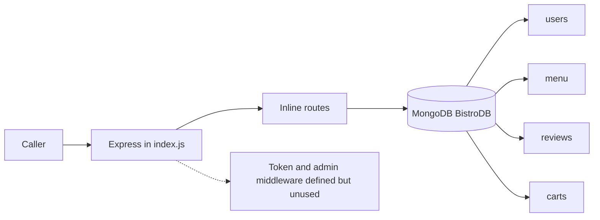

## 2. MVP system architecture

Target monorepo is food-intelligence-platform. Current Markdown is still under docs; the portal's future home is apps/docs.

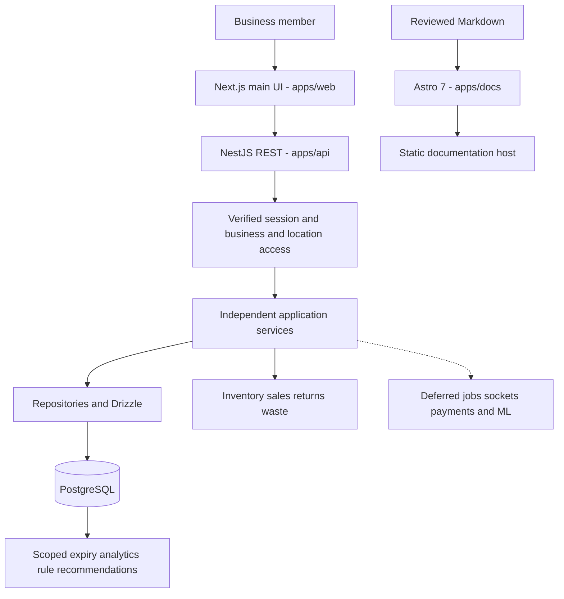

## 3. MVP backend module architecture

Business and location context reaches every owner. Sales, returns, and waste call Inventory's transactional boundary.

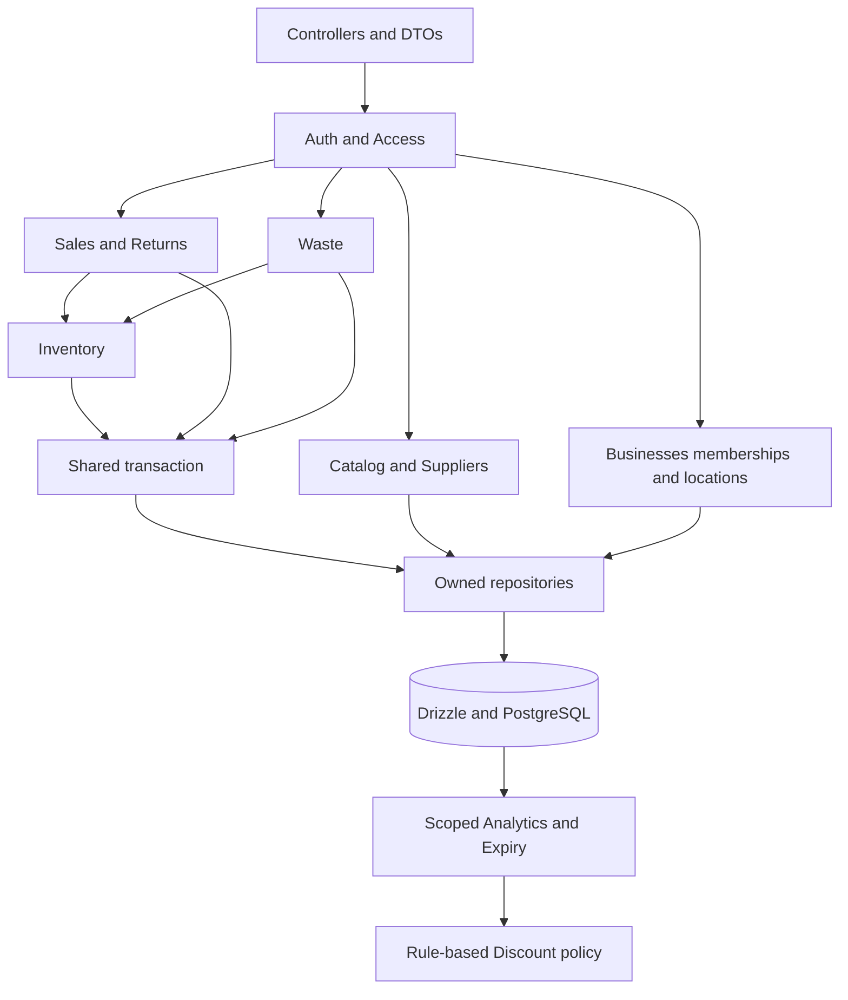

## 4. Database ER diagrams — MVP and deferred

Twenty-one MVP table designs are independent of legacy schemas. Composite tenant/location keys and cross-row checks are specified in the schema document; these drawings are not executable DDL.

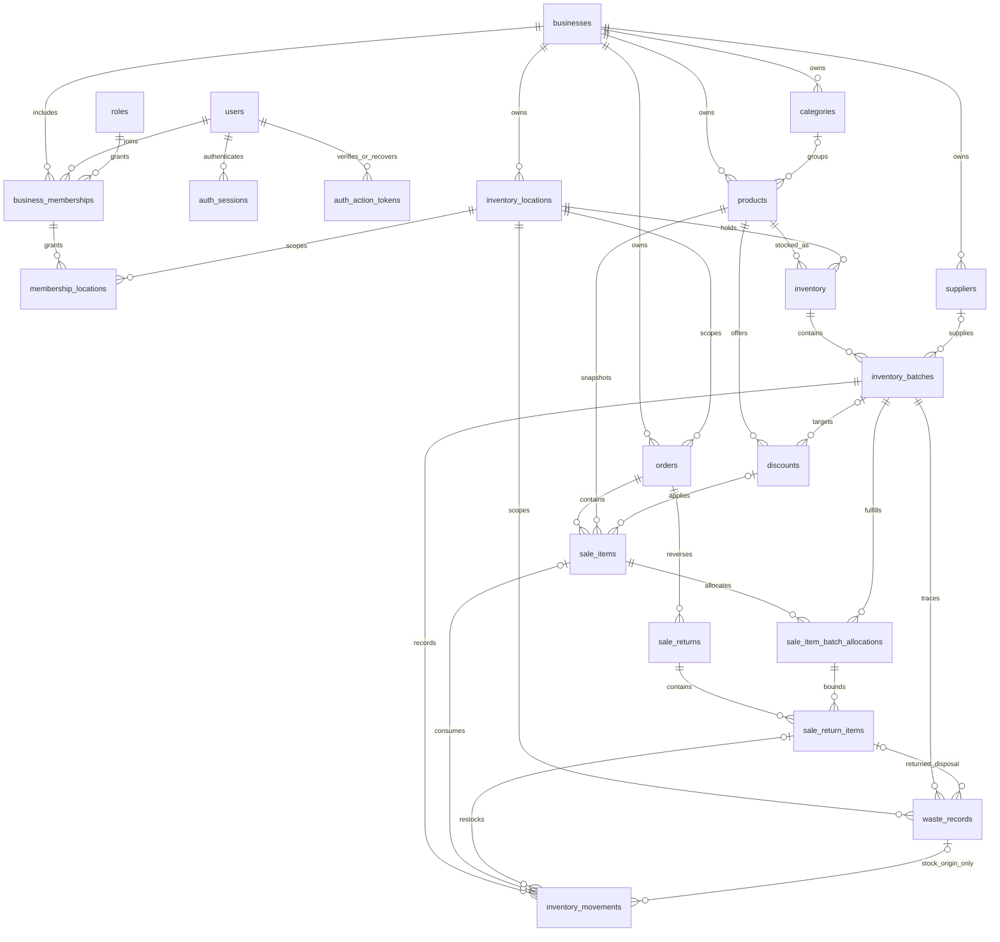

The following eight candidates are deferred. Existing MVP entities appear only to show potential references; no migrations should create deferred tables prematurely.

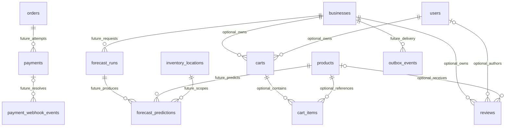

## 5. Inventory lifecycle

Stock never becomes negative. Transfers conserve quantities; expiry classification does not dispose stock.

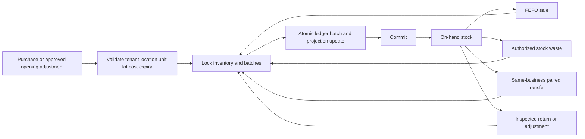

## 6. MVP sales and return lifecycle

No cart or payment provider is required. Financial return recording is not evidence of external money movement.

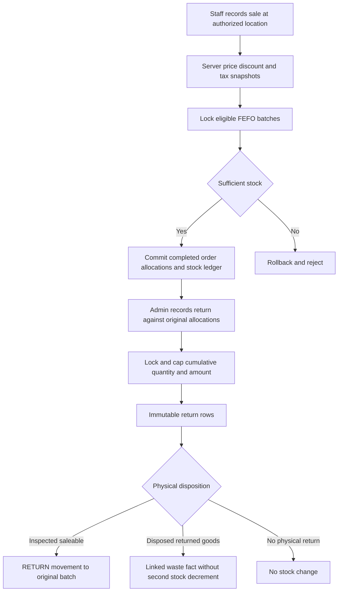

## 7. Waste lifecycle

Stock-origin waste decrements stock atomically; customer-return disposal must not subtract stock already removed by the original sale.

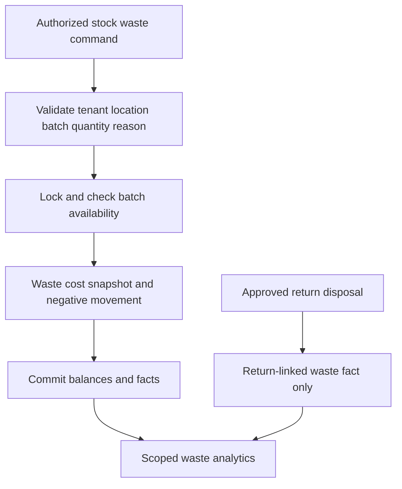

## 8. MVP expiry and discount flow

Request-time queries provide two warning levels. Future scans/notifications reuse this policy rather than owning separate rules.

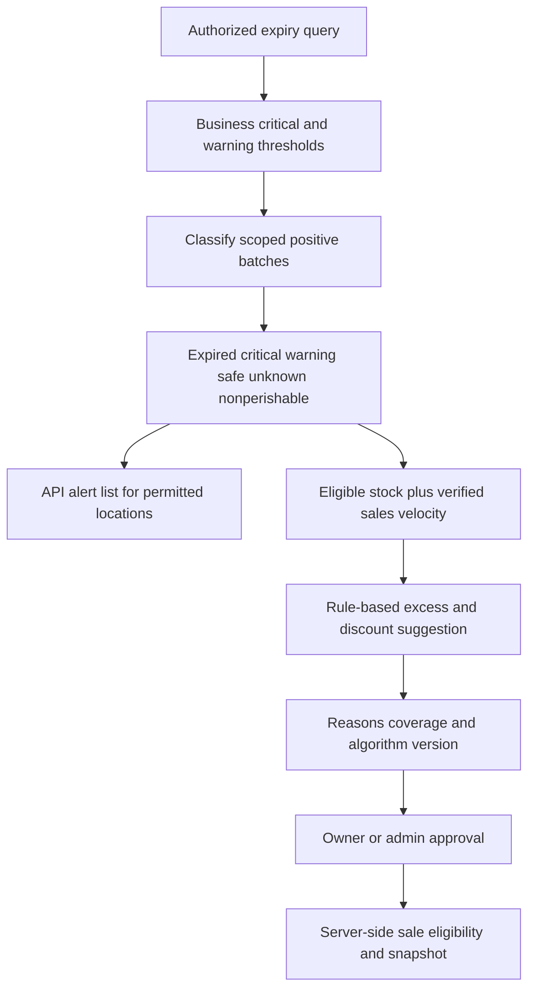

## 9. MVP API request flow

Tenant and location checks precede queries and are repeated for referenced resources. No queued notification dependency exists.

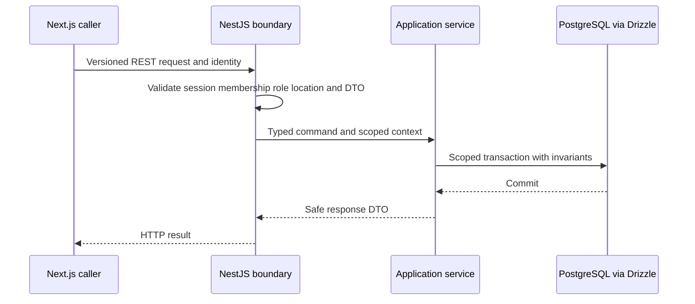

## 10. Deferred BullMQ and Redis flow

Queue delivery is at least once. PostgreSQL retains durable intent if Redis is unavailable.

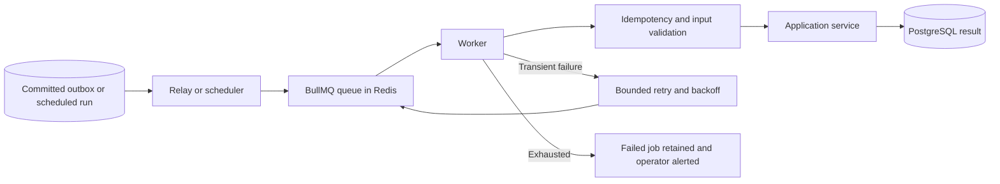

## 11. Deferred Socket.IO event flow

Rooms derive from server-verified membership; clients cannot choose arbitrary business rooms.

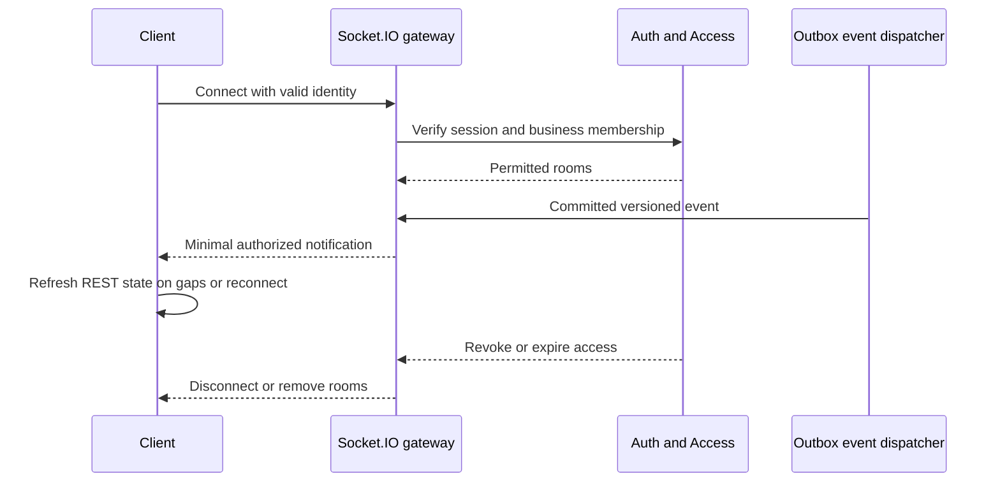

## 12. Deferred payment flow

Future restaurant-order payments start in Stripe Test Mode, not SaaS billing. Webhook signatures, persisted idempotency, and compensation bridge the provider boundary. MVP sales do not invoke this flow.

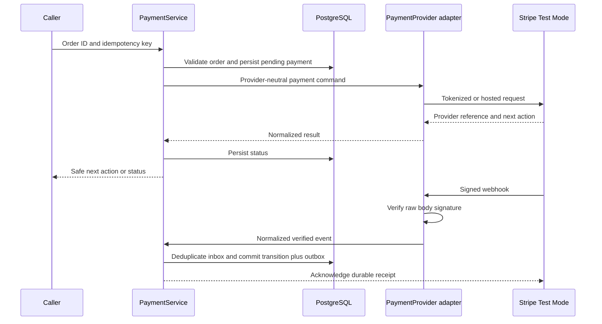

## 13. Deferred ML and data flow

When forecasting is approved, start with a statistical baseline. Both forecast persistence and external ML are outside this MVP; sufficient history and evaluation are prerequisites.

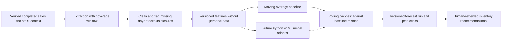

## 14. CI/CD flow

No workflow exists today. MVP needs isolated PostgreSQL and auth/tenant tests, not unused provider/queue services.

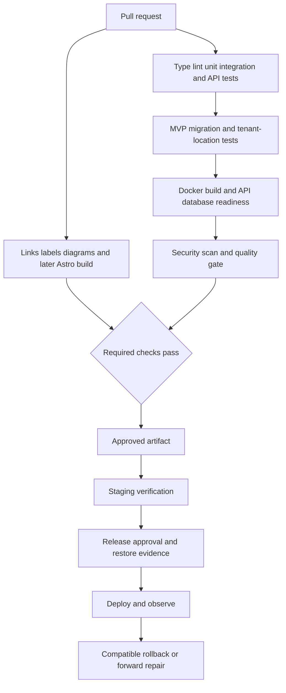

## 15. Target file and module dependency flow

All paths are proposed under food-intelligence-platform; no legacy index.js import is allowed. Shared public contracts never import server internals.

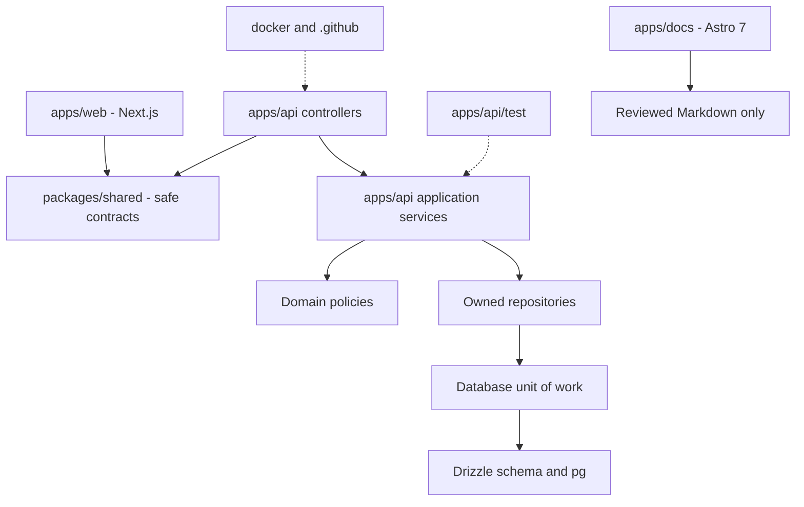

## 16. Multi-tenant access flow

A user can join multiple businesses, but every operation checks one business and a permitted location set.

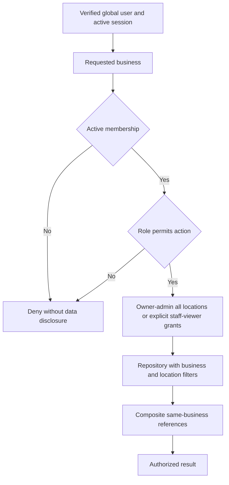

